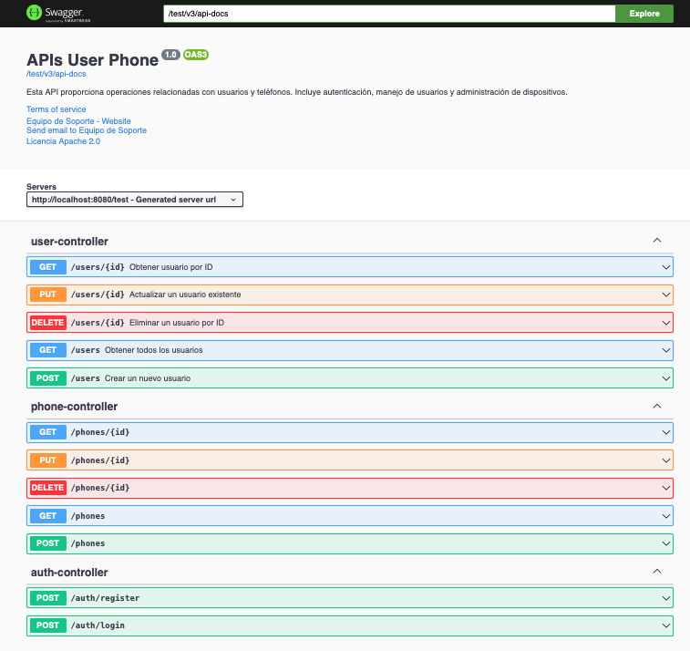
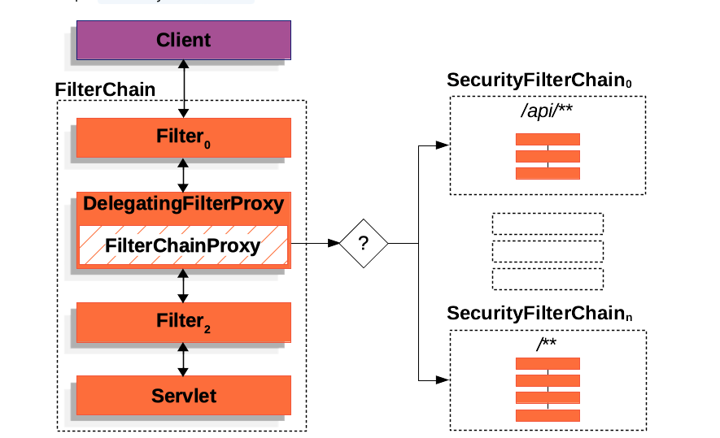

# Desafío Nisum Java Spring Security

## Descripción

Esta API RESTful está desarrollada en Java con Spring Boot y permite la gestión de usuarios y teléfonos. La autenticación está basada en tokens JWT. Todos los endpoints aceptan y devuelven datos en formato JSON. Además, se aplican validaciones para garantizar que los correos y contraseñas cumplan con los requisitos especificados. La API incluye la documentación Swagger para facilitar su uso y prueba.

## Tecnologías Utilizadas

- **Java 8+** - Lenguaje de programación.
- **Spring Boot** - Framework principal para el desarrollo de la API.
- **JPA (Hibernate)** - Manejador de la persistencia de datos.
- **H2 Database** - Base de datos en memoria para desarrollo.
- **JWT (Json Web Tokens)** - Mecanismo de autenticación basado en token.
- **Swagger** - Documentación interactiva para la API.
- **Maven** - Herramienta para la gestión de dependencias y el build.
- **JUnit** - Pruebas unitarias para asegurar la calidad del código.

## Endpoints de la API

### Usuarios

| Método | Endpoint         | Descripción                                  | Autenticación |
|--------|------------------|----------------------------------------------|---------------|
| POST   | /api/users        | Registro de un nuevo usuario                 | No            |
| GET    | /api/users/{id}   | Obtiene los detalles de un usuario por ID    | Sí (JWT)      |
| PUT    | /api/users/{id}   | Actualiza un usuario existente               | Sí (JWT)      |
| DELETE | /api/users/{id}   | Elimina un usuario por ID                    | Sí (JWT)      |
| GET    | /api/users        | Listar todos los usuarios                    | Sí (JWT)      |

### Teléfonos

| Método | Endpoint         | Descripción                                  | Autenticación |
|--------|------------------|----------------------------------------------|---------------|
| GET    | /api/phones       | Listar todos los teléfonos                   | Sí (JWT)      |
| GET    | /api/phones/{id}  | Obtener detalles de un teléfono específico   | Sí (JWT)      |
| PUT    | /api/phones/{id}  | Actualizar un teléfono existente             | Sí (JWT)      |
| DELETE | /api/phones/{id}  | Eliminar un teléfono por ID                  | Sí (JWT)      |

### Autenticación

| Método | Endpoint         | Descripción                                  | Autenticación |
|--------|------------------|----------------------------------------------|---------------|
| POST   | /auth/register    | Registro de un nuevo usuario con credenciales| No            |
| POST   | /auth/login       | Inicia sesión y retorna el token JWT         | No            |

### Ejemplo de solicitud de registro

```json
{
  "name": "Alejandro Sandoval",
  "email": "alejandro.sandoval@ugm.cl",
  "password": "p2",
  "phones": [
	{
	  "number": "963038688",
	  "citycode": "2",
	  "countrycode": "56"
	}
  ]
}
```

### Ejemplo de respuesta exitosa

```json
{
  "id": "uuid-generated",
  "created": "2024-10-12T12:45:32",
  "modified": "2024-10-12T12:45:32",
  "last_login": "2024-10-12T12:45:32",
  "token": "jwt-token",
  "isactive": true
}
```

## Requisitos Previos

- Tener **Java 8** o superior instalado.
- Tener **Maven** instalado para gestionar las dependencias.

## Configuración del Proyecto

1. **Clonar el repositorio:**

   ```bash
   git clone https://github.com/tu-usuario/user-registration-api.git
   cd user-registration-api
   ```

2. **Construir el proyecto:**

   ```bash
   mvn clean install
   ```

3. **Ejecutar la aplicación:**

   ```bash
   mvn spring-boot:run
   ```

4. **Acceder a Swagger:**
   
   Una vez que la aplicación esté corriendo, puedes acceder a la documentación interactiva de la API en:

	```
   	http://localhost:8080/testnisum/swagger-ui.html
   	```
   	
  

5. **Archivo Postman:**
   
	Json para importar en postman 

	```
  	testNisum/test/src/main/resources/postman/api-test.json
   	```
   


## Base de Datos

El proyecto utiliza **H2 Database** en memoria. No es necesario configurar manualmente la base de datos, ya que se inicializa automáticamente al arrancar la aplicación.

### Acceso a la Consola H2

Puedes acceder a la consola de la base de datos H2 en:
```
http://localhost:8080/testnisum/h2-console
```
- **JDBC URL**: `jdbc:h2:mem:testdb`
- **User**: `sa`
- **Password**: *(dejar vacío)*

## Validaciones

### Validación de Email

El correo debe seguir el formato: `aaaaaaa@dominio.cl`.

### Validación de Contraseña

La contraseña debe cumplir con la expresión regular configurada en el archivo `application.properties`:

```properties
password.regex=^(?=.*[A-Z])(?=.*[a-z])(?=.*[0-9])(?=.*[!@#$&*]).{8,}$
```

Esta expresión regular requiere que la contraseña contenga al menos una letra mayúscula, una letra minúscula, un número y un carácter especial, con un mínimo de 8 caracteres.

## Diagrama de la Solución


Este diagrama muestra los componentes principales de la aplicación, incluyendo controladores, servicios, y repositorios que interactúan con la base de datos y manejan la lógica de negocio.


## Diagrama de Arquitectura Spring Security de Alto Nivel



Este diagrama muestra los componentes principales de la aplicación, incluyendo controladores, servicios, y repositorios que interactúan con la base de datos y manejan la lógica de negocio.


## CI/CD

Este proyecto incluye integración continua configurada mediante **GitHub Actions**. Cada vez que se realiza un push o pull request en la rama principal, se ejecutan automáticamente las pruebas y se construye el proyecto.

## Pruebas Unitarias

Las pruebas unitarias se encuentran en el directorio `src/test/java`. Se pueden ejecutar con el siguiente comando:

```bash
mvn test
```


## Contacto

Si tienes alguna pregunta o sugerencia, no dudes en contactarme en [alejandro.sandoval@ugm.cl](mailto:alejandro.sandoval@ugm.cl).
